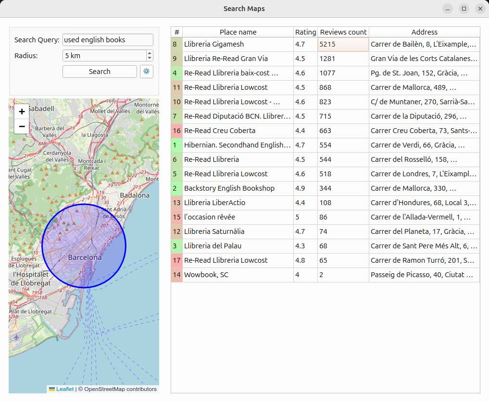

# SearchMaps



SearchMap is a vibe-coded Python app that helps you find places, showing the ones with the most reviews first. Just double-click on a result to open it in Google Maps in your browser.

## Quick Start

Create python virtual environment and install dependencies:

```
python3 -m venv venv
source venv/bin/activate
pip install -r requirements.txt
```

Start the application:

```
python src/search_maps.py
```

## Google Maps API Key

This application requires a Google Maps API key. You can obtain an API key by following these steps:

1. Go to the [Google Cloud Console](https://console.cloud.google.com/).
2. Create or select a project.
3. Navigate to **APIs & Services > Credentials**.
4. Click **Create credentials** and select **API key**.
5. Enable the required Google Maps APIs.
